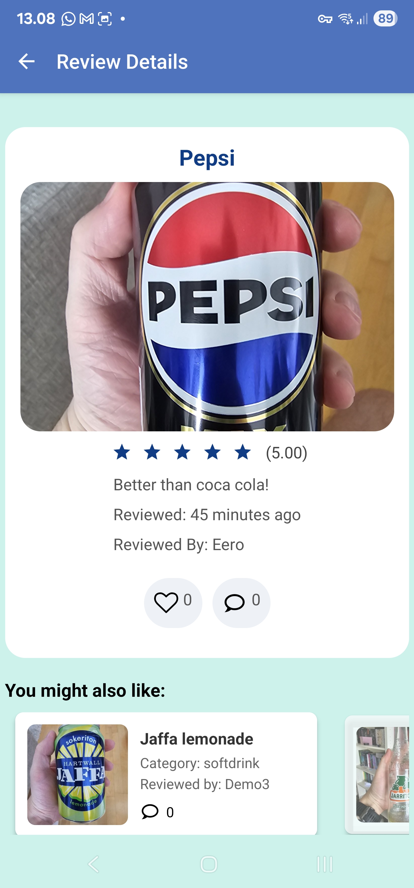
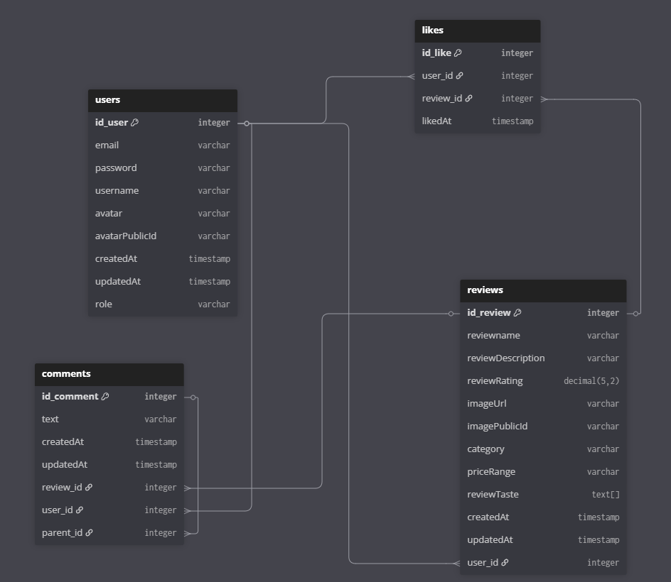
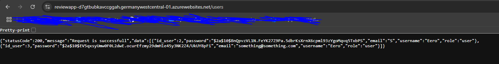

# Project ReviewApp Overview

## Demo photos

## What this project is about?

This project was designed to deepen my understanding of NestJS and React Native by building a full-stack application. I wanted to gain hands-on experience with NestJS for the back-end and React Native for the front-end, allowing me to enhance my skills in both areas. Through this project, I have been able to explore these technologies in a practical context, creating something functional that I can continue to expand and refine as I learn and grow.

**Key Features:**

- Easy login and signup
- Write, submit, and delete your own reviews
- Add/remove comments on reviews
- Like your favorite reviews and comments
- Search for reviews and other users
- Smooth pop-up modals for quick actions
- Smart recommendations using TensorFlow
- Automated CI/CD
- Runs in Docker and deployed on Azure (Cost money, so not on anymore)
- Cloudinary to store images
- Darkmode / Lightmode

## **Key Technologies Used:**

- **Front-end**:

  - TypeScript
  - [React Native](https://reactnative.dev/): Used for building the mobile application.
  - [Expo](https://expo.dev/): Simplifies development with features like Expo Camera.
  - State Management: Contex Api
  - Navigation: [React Navigation](https://reactnavigation.org/) for handling screens and navigations.
  - Animations: [Reanimated](https://docs.swmansion.com/react-native-reanimated/) making animations for modals and searchbar.
  - Async Storage: Store user info.

- **Back-end**:
  - TypeScript
  - [NestJS](https://docs.nestjs.com/) with passport (JWT strategy)
  - [PostgreSQL](https://www.postgresql.org/)
  - [Tensorflow](https://www.tensorflow.org/) using premade model
  - [TypeORM](https://typeorm.io/)
  - [Cloudinary](https://cloudinary.com/) Store images

## Database Schema

This section describes the key entities and their relationships in the application’s PostgreSQL database. Additionally, I've created Docker images and deployed them to Azure for a limited time due to cost considerations.

### **User Entity**

The `User` entity represents a user in the application.

- **Columns**:

  - `id_user`: ID
  - `email`: Unique email address for user identification.
  - `password`: Stores the user's hashed password.
  - `username`: The name of the user.
  - `role`: Defines the user's role (default: "user").

- **Relationships**:

  **Reviews**: A user can create many reviews (`One-to-Many` relationship).

  **Comments**: A user can make many comments (`One-to-Many` relationship).

  **Likes**: A user can like many reviews (`One-to-Many` relationship).

  **Replies**: A user can make many replies (`One-to-Many` relationship).

### **Review Entity**

The `Review` entity represents a review posted by a user about a product.

- **Columns**:

  - `id_review`: ID
  - `reviewname`: The name/title of the review.
  - `reviewDescription`: A detailed description of the review.
  - `reviewRating`: The rating given by the user.
  - `reviewTaste`: Taste profile, where you can select taste which describes the drink.
  - `imageUrl`: A URL pointing to an image associated with the review.
  - `category`: The category of the review (e.g., beer, wine, etc.).

- **Relationships**:

  **User**: Each review is linked to a user who created it (`Many-to-One` relationship).

  **Comments**: A review can have many comments (`One-to-Many` relationship).

  **Likes**: A review can have many likes from different users (`One-to-Many` relationship).

### **Comment Entity**

The `Comment` entity represents a comment made by a user on a review.

- **Columns**:

  - `id_comment`: ID
  - `text`: The content of the comment.
  - `createdAt`: Timestamp of when the comment was created.
  - `updatedAt`: Timestamp of when the comment was last updated.

- **Relationships**:

  **Review**: Each comment is associated with a review (`Many-to-One` relationship).

  **User**: Each comment is made by a user (`Many-to-One` relationship).

  **Replies**: A comment can have many replies (`One-to-Many` relationship).

### **Like Entity**

The `Like` entity represents a like given by a user to a review.

- **Columns**:

  - `id_like`: ID
  - `likedAt`: Timestamp of when the like was created.

- **Relationships**:

  **Review**: Each like is associated with a specific review (`Many-to-One` relationship).

  **User**: Each like is given by a user (`Many-to-One` relationship).

### Example API Endpoints

**Auth**

- `POST /auth/register` → Create a new user
- `POST /auth/login` → Returns JWT token

**Users**

- `GET /users/:id_user` → Get one user by id_user
- `GET /users` Get all users
- `PATCH /users/avatar/:id_user` Update avatar using id_user
- `PUT /users/:id_user` Update user using id_user
- `DELETE /users/:id_user` Delete user using id_user

**Reviews**

- `GET /review` → Get all reviews
- `GET /review/all?category=:category` → Get all reviews by category
- `GET /review/:id` → Get one review using id_review
- `GET /review/user/:id_user` → Get all reviews by a user using id_user
- `GET /review/users/:id_user/reviews?category=:category` → Get all reviews by a user, optionally filtered by category
- `GET /review/user/favorites/:id_user` → Get a user's favorite reviews using id_user
- `POST /review` → Create a new review (auth required)
- `PATCH /review/:id_review` → Update a review using id_review (auth required)
- `DELETE /review/:id` → Delete a review using id_review (auth required)

**Comments**

- `GET /comments` → Get all comments
- `GET /comments/:id` → Get a comment using id_comment
- `GET /comments/review/:id_review` → Get all comments for a specific review using id_review
- `GET /comments/reply/:id_comment` → Get all replies for a specific comment using id_comment
- `POST /comments` → Create a top-level comment (Works, but quite confusing)
- `POST /comments/reply/:parentCommentId` → Create a reply to an existing comment using id_comment
- `DELETE /comments/:id` → Delete a comment using id_comment (auth required)

**Likes**

- `POST /likes/like/review/:id_review` → Like a review using id_review
- `DELETE /likes/unlike/review/:id_review/user/:id_user` → Unlike a review using id_review and id_user
- `GET /likes/users/review/:id_review` → Get all users who liked a specific review using id_review
