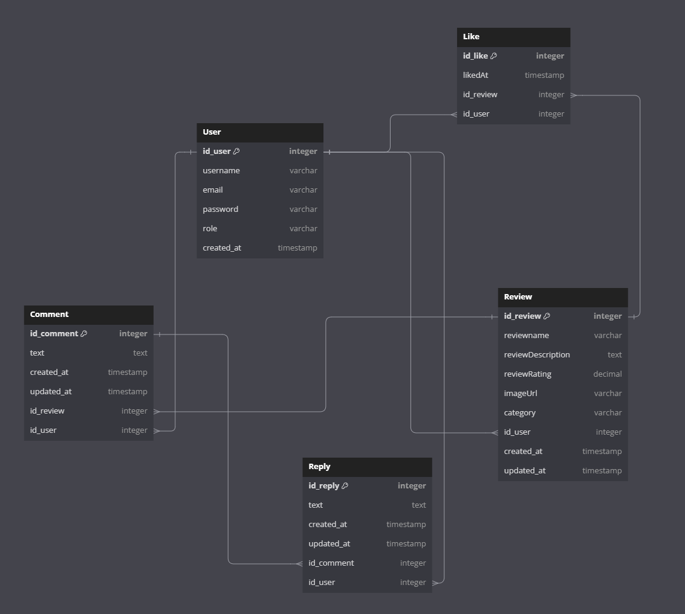

# Project ReviewApp Overview (Not Ready!)

## What this project is about?

This project was designed to deepen my understanding of NestJS and React Native by building a full-stack application. I wanted to gain hands-on experience with NestJS for the back-end and React Native for the front-end, allowing me to enhance my skills in both areas. Through this project, I have been able to explore these technologies in a practical context, creating something functional that I can continue to expand and refine as I learn and grow.

- **Key Features**:
  - User Login and register
  - Add reviews by filling a form
  - Add comments to reviews
  - Liking system
  - Search reviews and other users
  - Modals
  - CI/CD Docker

## **Key Technologies Used:**

- **Front-end**:
  - TypeScript
  - [React Native](https://reactnative.dev/): Used for building the mobile application, ensuring a smooth and responsive user experience.
  - [Expo](https://expo.dev/): Simplifies development with features like Expo Camera.
  - State Management: Contex Api
  - Navigation: [React Navigation](https://reactnavigation.org/) for handling screens and navigations.
  - Animations: [Reanimated](https://docs.swmansion.com/react-native-reanimated/) for searchbar and modals.
  - Async Storage: Store user info.

- **Back-end**:
  - TypeScript
  - [NestJS](https://docs.nestjs.com/) with passport (JWT strategy)
  - [PostgreSQL](https://www.postgresql.org/)
  - [TypeORM](https://typeorm.io/)

## Database Schema

This section describes the key entities and their relationships in the application’s PostgreSQL database.

### **User Entity**

The `User` entity represents a user in the application.

- **Columns**:
  - `id_user`: A unique, auto-generated identifier for each user.
  - `email`: Unique email address for user identification.
  - `password`: Stores the user's hashed password.
  - `username`: The name of the user.
  - `role`: Defines the user's role (default: "user").

- **Relationships**:

  **Reviews**: A user can create many reviews (`One-to-Many` relationship).
  
  **Comments**: A user can make many comments (`One-to-Many` relationship).
  
  **Likes**: A user can like many reviews (`One-to-Many` relationship).
  
  **Replies**: A user can make many replies (`One-to-Many` relationship).

### **Review Entity**

The `Review` entity represents a review posted by a user about a product.

- **Columns**:
  - `id_review`: A unique, auto-generated identifier for each review.
  - `reviewname`: The name/title of the review.
  - `reviewDescription`: A detailed description of the review.
  - `reviewRating`: The rating given by the user.
  - `imageUrl`: A URL pointing to an image associated with the review.
  - `category`: The category of the review (e.g., beer, wine, etc.).

- **Relationships**:

  **User**: Each review is linked to a user who created it (`Many-to-One` relationship).
  
  **Comments**: A review can have many comments (`One-to-Many` relationship).
  
  **Likes**: A review can have many likes from different users (`One-to-Many` relationship).

### **Comment Entity**

The `Comment` entity represents a comment made by a user on a review.

- **Columns**:
  - `id_comment`: A unique, auto-generated identifier for each comment.
  - `text`: The content of the comment.
  - `createdAt`: Timestamp of when the comment was created.
  - `updatedAt`: Timestamp of when the comment was last updated.

- **Relationships**:

   **Review**: Each comment is associated with a review (`Many-to-One` relationship).
  
   **User**: Each comment is made by a user (`Many-to-One` relationship).
  
   **Replies**: A comment can have many replies (`One-to-Many` relationship).

### **Like Entity**

The `Like` entity represents a like given by a user to a review.

- **Columns**:
  - `id_like`: A unique, auto-generated identifier for each like.
  - `likedAt`: Timestamp of when the like was created.

- **Relationships**:

  **Review**: Each like is associated with a specific review (`Many-to-One` relationship).
  
  **User**: Each like is given by a user (`Many-to-One` relationship).

### **Reply Entity**

The `Reply` entity represents a reply made by a user to a comment.

#### Key Features

- `id_reply`: A unique, auto-generated identifier for each reply.

- **Columns**:
  - `text`: The content of the reply.
  - `createdAt`: Timestamp of when the reply was created.
  - `updatedAt`: Timestamp of when the reply was last updated.

- **Relationships**:

  **Comment**: Each reply is associated with a specific comment (`Many-to-One` relationship).
  
  **User**: Each reply is made by a user (`Many-to-One` relationship).
